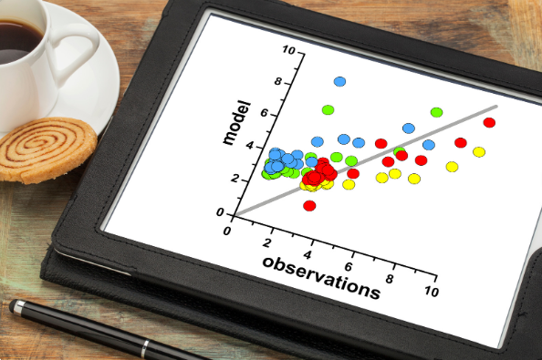

```{r setup, include=FALSE}
knitr::opts_chunk$set(echo = FALSE)
```

## Learning Outcomes
<div class="columns-2">
  

  At the end of this lesson, students should be able to:

1. interpret scatterplots.
2. differentiate between correlation and regression.
3. evaluate and interpret the Pearson’s and Spearman’s rank correlation coefficient.
4. find the equations and explain about the variation of regression lines.
</div>


