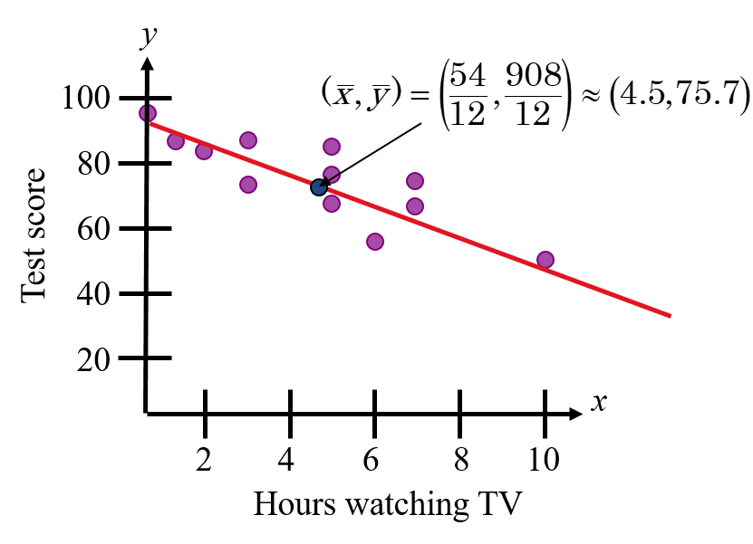

```{r setup, include=FALSE}
knitr::opts_chunk$set(echo = FALSE)
library(png)
library(kableExtra)
library(ggplot2)
library(grid)
library(gridExtra)
library(RefManageR)
library(tidyverse)
library(data.table)
knitr::write_bib(x = "rmarkdown", file = "bib.bib")
```
# Learning Outcomes

At the end of this lesson, students should be able to:

1. interpret **scatterplots**.

1. differentiate between **correlation** and **regression**.

1. evaluate and interpret the **Pearson’s** and **Spearman’s rank correlation coefficient**.

1. evaluate the **significance of correlation coefficient**.

1. formulate the **regression equations** 

1. explain about the **proportion of variation in dependent variable** using **coefficient of determination**.


```{r echo=FALSE,fig.align='right',out.width="30%"}
knitr::include_graphics('figure/correlationimage.png')
```

---

# Statistical Analysis (Example)

In a study conducted in Australia, 5 patients with hypertriglyceridemia were placed on a low-fat, high-carbohydrate diet. Before the start of the diet, cholesterol and triglyceride measurements were recorded for each subject. 

```{r}
patients <- c(1,2,3,4,5)
x <- c(5.12,6.18,6.77,6.65,6.36)
y <- c(2.3,2.54,2.95,3.77,4.18)
df1 <- data.frame(x0=patients,x1=x, x2=y)
names(df1)=c("Patients","Cholesterol Level (mmol/l)","Triglyceride Level (mmol/l)")
knitr::kable(df1,align=rep('c', 5), format = 'html',escape = F) %>% row_spec(1, bold = TRUE,background = "#9CCFF33")
```

1. Sketch a scatterplot
2. Is there a correlation between cholesterol and triglyceride levels?Justify your answer.
3. Assume that the data is not normally distributed, calculate the correlation coefficient.
4. Is the correlation significant at 0.05 level of significance? At 0.01?
5. What is the triglyceride level if patient XYZ has cholesterol level of 10.5?
6. Find and interpret the coefficient of determination.
---


# Outlines


- Bivariate Data

- Scatterplots

- Correlation VS Regression

- Simple Linear Correlation

  - Linear Correlation Coefficient
  - Pearson's Product Moment Correlation Coefficient, _r_
  - Spearman's Rank Correlation Coefficient, _r<sub>s</sub>_
  - Testing the Significance of Correlation
  
- Simple Linear Regression

  - The Least Square Regression

- Coefficient of Determination, _R<sup>2</sup>_
---

class: inverse, center, middle

# BIVARIATE DATA

---

# Bivariate Data

- Two selected random variables recorded from each sampling unit
  - Abundance of a _plant species_ and _soil pH_ from each of several sampled plots
  - _Blood pressure_ and _body weight_ from patients

- During correlation analysis, the relationship between two continuous variables is described.

- Use that relationship as a basis for prediction.

- Multivariate data – when more than two variables recorded from one sampling unit.
---

class: inverse, center, middle

# SCATTERPLOTS

---

# Scatterplots

.pull-left[
- A graph in which the paired (x,y) sample data are plotted with horizontal x-axis and
a vertical y-axis.

- Each individual (x,y) pair is plotted as a single point.

- Scatterplots are created by setting up two continuous axes, then creating a dot for
every pair of observations.

]
.pull-right[
```{r fig.height=4, dev='svg', echo=FALSE}
par(mar = c(4, 4, 1, 1))
plot(cars, pch = 19, col = 'darkgray', las = 1, main = "Scatterplot of Speed VS Distance")
```
]
---

# Scatterplots (example)

- Weight and systolic blood pressure of 10 patients.

.pull-left[

```{r}
#occur <- matrix(c("67","69","85","83","74","81","97","92","114","85","120","125","140","160","130","180","150","140","200","130"),ncol=10,byrow=TRUE)
x <- c(67,69,85,83,74,81,97,92,114,85)
y <- c(120,125,140,160,130,180,150,140,200,130)
df1 <- data.frame(x1=x, x2=y)
names(df1)=c("Weight (kg)","SBP (mmHg)")
knitr::kable(df1,align=rep('c', 7), format = 'html',escape = F)
```
]
.pull-right[
```{r}
ggplot(df1,aes(`Weight (kg)`,`SBP (mmHg)`))+geom_point(aes(color="firebrick",size=0.3))+ xlab("Weight (kg)")+ylab("SBP (mmHg)")+ggtitle("Scatterplot of Weight VS SBP")+ theme(plot.title = element_text(hjust = 0.5,size=20,face="bold"),axis.title.x = element_text(size=15, face="bold"), axis.title.y = element_text(size=15, face="bold"), legend.position = "none")
```
]
---

# Scatterplots Interpretation

```{r, echo=FALSE,out.width="35%",out.height="18%",fig.cap="*slope depicts the direction, amount of scatter depicts the strength",fig.show='hold',fig.align='center'}
knitr::include_graphics(c("figure/sc1.png","figure/sc2.png","figure/sc3.png"))
```

```{r eval=FALSE}
img1 <- rasterGrob(as.raster(readPNG("figure/sc1.png")), interpolate = FALSE)
img2 <- rasterGrob(as.raster(readPNG("figure/sc2.png")), interpolate = FALSE)
img3 <- rasterGrob(as.raster(readPNG("figure/sc3.png")), interpolate = FALSE)
grid.arrange(img1, img2, img3, ncol = 3)
```

```{r eval=FALSE}
df<-data.frame(ImageName=c("knitr::include_graphics(\"figure/scatterplot1.png\")","knitr::include_graphics(\"figure/scatterplot2.png\")", "knitr::include_graphics(\"figure/scatterplot3.png\")"), Text = c("Perfect positive correlation (+1.00)", "Perfect negative correlation (-1.00)", "No relationship (0.00)"))
# Change to names of my local images
#df$ImageName =c("figure/scatterplot1.png","figure/scatterplot2.png","figure/scatterplot3.png")
knitr::kable(df,align=rep('c', 2), escape = FALSE)
# Add appropriate rmarkdown tagging
#df$ImageName = sprintf("", df$ImageName)
#knitr::include_graphics('/path/to/image.png')
#knitr::kable(df,align=rep('c', 2), format = 'html')
         #      kable_styling(full_width=FALSE) %>% 
         # collapse_rows(columns=1, valign="top"))
               
```
---

class: inverse, center, middle

# CORRELATION VS REGRESSION

---

# Correlation Analysis

.pull-left[
- Correlation is concerned with measuring **strength** (degree of association) and **direction**
(positive or negative) of the relationship between variables.

- No hypothesised cause and effect relationship between variables.

- It does not matter which variable is on the x- or y-axis.
]

.pull-right[
```{r echo=FALSE}
x = runif(50,0,50)
y = x + rnorm(50,0,5)
df <- data.frame(x,y)
ggplot(df,aes(x,y))+geom_point(color="#CC3399",aes(size=0.3))+ xlab("X - Height of Eldest Child")+ylab("Y - Height of Youngest Child")+theme(plot.title = element_text(hjust = 0.5,size=20,face="bold"),axis.title.x = element_text(size=20, face="bold"), axis.title.y = element_text(size=20, face="bold"), legend.position = "none")
```

]
---

# Regression Analysis

.pull-left[
- Regression analysis is helpful in assessing specific forms of the relationship between variables. 

- The ultimate objective is to **predict** or **estimate** the value of one variable corresponding to a given value of another variable.

- Causal relationship is believed to exist.

- Potential response variable (dependent) on yaxis; explanatory or predictor variable
(independent) on x-axis.
]

.pull-right[
```{r echo=FALSE}
x = runif(50,0,50)
y = x + rnorm(50,0,5)
df <- data.frame(x,y)
ggplot(df,aes(x,y))+geom_point(color="blue4",aes(size=0.3))+ xlab("X - BMI")+ylab("Y - Fat Percentage")+geom_smooth(color="red",method='lm',se=FALSE)+theme(plot.title = element_text(hjust = 0.5,size=20,face="bold"),axis.title.x = element_text(size=20, face="bold"), axis.title.y = element_text(size=20, face="bold"), legend.position = "none")
```
]

---

class: inverse, center, middle

# SIMPLE LINEAR CORRELATION

---

# Correlation

- A *correlation* is a relationship between two variables.

- The data can be represented by the ordered pairs (x, y) where **x is usually the independent (or explanatory)** variable, and **y is the dependent (or response) variable**.

- A scatterplot is used to determine whether a linear (straight line) correlation exists between two variables.

.pull-left[

```{r}
#occur <- matrix(c("67","69","85","83","74","81","97","92","114","85","120","125","140","160","130","180","150","140","200","130"),ncol=10,byrow=TRUE)
x <- c(67,69,85,83,74,81,97,92,114,85)
y <- c(120,125,140,160,130,180,150,140,200,130)
df1 <- data.frame(x1=x, x2=y)
names(df1)=c("Weight (kg)","SBP (mmHg)")
knitr::kable(df1,align="c", format = 'html',table.attr = "style='height:30%;'",escape = F)%>% kable_styling(bootstrap_options = "striped", full_width = F)
```
]
.pull-right[
```{r fig.width = 4, fig.height = 4}
ggplot(df1,aes(`Weight (kg)`,`SBP (mmHg)`))+geom_point(aes(color="firebrick",size=0.1))+ xlab("Weight (kg)")+ylab("SBP (mmHg)")+ggtitle("Scatterplot of Weight VS SBP")+ theme(plot.title = element_text(hjust = 0.5,size=10,face="bold"),axis.title.x = element_text(size=10, face="bold"), axis.title.y = element_text(size=12, face="bold"), legend.position = "none")
```
]


---

# Correlation Analysis

- If we are interested only in determining whether a relationship exists, we employ correlation analysis.

- No distinction between explanatory (x) and response (y) variable.

- Requires both variables to be quantitative or continuous variables (no categorical or nominal variables).

- Both variables must be normally distributed. If one or both are not, either transform the variables to near normality or use an alternative non-parametric test of Spearman.

---

# Interpreting Correlation (Strength)

```{r echo=FALSE, fig.cap="Correlation scatter plots between two variables. Image credit: Yadav Suniti (2018)", out.width="70%",fig.align = "center"}
knitr::include_graphics('figure/correlationsc.jpg')
```
---

# Interpreting Correlation (Direction)
## Positive Correlation

.pull-left[
- The values of the two variables (x,y) **deviate in the same direction**.

- i.e. if an increase (or decrease) in the values of one variable results on an average, in a corresponding increase (or decrease) in the values of the other variable.
]

.pull-right[
```{r echo=FALSE}

```
]
---
# Positive Correlation (Example)

1. Education level and salary potential.

2. People suffer from depression and suicidal
tendencies.

3. Household income and expenditure.

- In statistics, a perfect positive correlation is represented by the value of +1.00.

- The points lie close to a straight line, which has a positive gradient or direction.

---

# Interpreting Correlation (Direction)
## Negative Correlation

.pull-left[

- The values of the two variables (x,y) **deviate in opposite direction.**

- i.e. if an increase (or decrease) in the values of one variable results in an average, in corresponding decrease (or increase) in the values of the other
variable.
]

.pull-right[
```{r echo=FALSE}

```
]
---
# Negative Correlation (Example)

1. Price and demand of goods.

2. Depression and self esteem.

3. Amount of exercises and percentage of body
fat.

- In statistics, a perfect negative correlation is represented by the value of -1.00.
---
# Interpreting Correlation (Direction)

```{r, echo=FALSE,fig.align='center'}
#knitr::include_graphics(c("figure/pos-lin.png","figure/negativelinear.png","figure/nocorrelation.png","figure/nonlinear.png"))
img1 <- rasterGrob(as.raster(readPNG("figure/pos-lin.png")), interpolate = FALSE)
img2 <- rasterGrob(as.raster(readPNG("figure/negativelinear.png")), interpolate = FALSE)
img3 <- rasterGrob(as.raster(readPNG("figure/nocorrelation.png")), interpolate = FALSE)
img4 <- rasterGrob(as.raster(readPNG("figure/nonlinear.png")), interpolate = FALSE)
grid.arrange(img1, img2, img3, img4, ncol = 2)
```

---

class: center, middle

# Linear Correlation Coefficient

---

# Linear Correlation Coefficient, *r*

- The linear correlation coefficient is a measure of the **strength** and the **direction** of a linear relationship between two variables. 

- The symbol *r* represents the sample correlation coefficient. 

- Like the mean and SD, *r* is strongly affected by outliers and sample size.

- The formula for *r* is

$$r=\frac{n\sum{XY}-\sum(X)\sum(Y)}{\sqrt{[n\sum{X}^2-(\sum{X})^2][n\sum{Y}^2-(\sum{Y})^2]}}$$

- *r* does not measure nor describe curved or non-linear association no matter how strong.

---

# Linear Correlation Coefficient, *r*

- Unit-less and always between –1 and 1

- The closer to 1, the **stronger the positive linear relationship** (+*r*)

- The closer to –1, the **stronger the negative linear relationship** (-*r*)

- The closer to 0, the **weaker any positive/negative linear relationship**

- Equals 0, **no linear relationship exists**

- The extreme values +1 and -1 indicate **perfect linear relationship** (points lie exactly along a straight line)

---

# Linear Correlation Coefficient, *r*
```{r echo=FALSE, fig.align='center'}
knitr::include_graphics('figure/r-scale.png')
```

---

# Linear Correlation Coefficient, *r*
```{r echo=FALSE, fig.align='center',out.width="80%"}

```

---
class: center, middle

# Pearson's Product Moment Correlation Coefficient, _r_

---
# Pearson's Correlation Coefficient

- The most popular correlation coefficient.

- Used to determine the correlation between two variables under three conditions:

  1. Both variables must be **interval or ratio** measures.
  2. The relationship between the two variables **must be linear**.
  3. Both variables are **normally distributed**.

- Should use a large scale for variables (larger sample size) in this analysis.
---
# Pearson's Correlation Coefficient
## Calculation of *r*
<ol>
<li> Find $n$.
<li> Sum all the X-values. $\sum{X}$

<li> Sum all the Y-values. $\sum{Y}$

<li> Square each X-value and find the sum. $\sum{X}^2$

<li> Square each Y-value and find the sum. $\sum{Y}^2$

<li> Multiply each X-value by its corresponding Y-value. Find the sum. $\sum{XY}$

<li> Use these $n$ and five sums to calculate the coefficient, r
</ol>
$$r=\frac{n\sum{XY}-\sum(X)\sum(Y)}{\sqrt{[n\sum{X}^2-(\sum{X})^2][n\sum{Y}^2-(\sum{Y})^2]}}$$

---

# Pearson's Correlation Coefficient
## Example 1

The age *X* in months and vocabulary *Y* were measured for six children, with the results shown in the table. Calculate the correlation coefficient, r for the following data. Interpret the result.

```{r}
bil <- c("1","2","3","4","5","6")
x <- c(13, 14, 15, 16, 16, 18)
y <- c(12, 10, 15, 20, 27, 30)
df1 <- data.frame(x0=bil,x1=x, x2=y)
names(df1)=c("Child","Age","Vocabulary")
knitr::kable(df1,align=rep('c', 6), format = 'html',escape = F)
```

---
# Pearson's Correlation Coefficient
## Example 1

```{r}
bil <- c("1","2","3","4","5","6","Sum")
x <- c(13, 14, 15, 16, 16, 18,92)
y <- c(12, 10, 15, 20, 27, 30, 114)
x2 <- c(169,196,225,256,256,324, 1426)
y2 <- c(64,100,225,400,729,900, 2498)
xy <- c(104,140,225,320,432,540, 1813)
df1 <- data.frame(x0=bil, x1=x, x2=y, x3=x2, x4=y2, x5=xy)
names(df1)=c("Child","Age (X)","Vocabulary (Y)","X<sup>2</sup>", "Y<sup>2</sup>", "XY")
knitr::kable(df1,align=rep('c', 6), format = 'html',escape = F) %>% column_spec(4:6, bold = TRUE,background = "#99CCFF",width = "5em")
```
$$\small n=6, \sum{X}=92, \sum{Y}=114, \sum{X}^2=1426, \sum{Y}^2=2498, \sum{XY}=1813$$
---

# Pearson's Correlation Coefficient
$$\small n=6, \sum{X}=92, \sum{Y}=114, \sum{X}^2=1426, \sum{Y}^2=2498, \sum{XY}=1813$$
Substitute the formula with the values:
$$r=\frac{n\sum{XY}-\sum(X)\sum(Y)}{\sqrt{[n\sum{X}^2-(\sum{X})^2][n\sum{Y}^2-(\sum{Y})^2]}}$$
$$=\frac{6(1813)-(92)(114)}{\sqrt{[6(1426)-(92)^2][6(2498)-(114)^2]}}$$
$$r=\frac{10878-10488}{\sqrt{[8556-8464][14988-12996]}}=\frac{390}{\sqrt{[92][1992]}}=\frac{390}{428.09}\approx0.91$$

Interpretation: There is a **strong positive** linear correlation **between the age(*X*) in months** and **vocabulary(*Y*)** in six children. As the age of children increases, the number of vocabulary increases.
---

# Pearson's Correlation Coefficient
## Example 2

The following data represents the number of hours 12 different students watched television during the weekend and the scores of each student who took a test the following Monday.

  a) Display the scatter plot.
  
  b) Calculate and interpret the correlation coefficient, *r*.

```{r}
x <- c(0,1,2,3,3,5,5,5,6,7,7,10)
y <- c(96,85,82,74,95,68,76,84,58,65,75,50)
df1 <- data.frame(x1=x, x2=y)
names(df1)=c("Hours (X)","Test score (Y)")
t_df1 <- transpose(df1)
#df2 <- df1 %>%rownames_to_column %>%gather(var, value, -rowname) %>% spread(rowname, value)
#colnames(df2) <- c()
rownames(t_df1) <- colnames(df1)
colnames(t_df1) <- rownames(df1)
knitr::kable(t_df1,align=rep('c', 12), format = 'html',longtable=FALSE,escape = F) 
```
---

# Pearson's Correlation Coefficient
## Example 2 (Solution)

  a) Display the scatter plot.

```{r}
knitr::kable(t_df1,align=rep('c', 12), format = 'html',longtable=FALSE,escape = F) 
```
```{r fig.width = 3.5, fig.height = 3.5, fig.align='center'}
ggplot(df1,aes(`Hours (X)`,`Test score (Y)`))+geom_point(aes(color="firebrick",size=0.3))+ xlab("Hours Watching TV")+ylab("Test score")+ theme(plot.title = element_text(hjust = 0.5,size=20,face="bold"),axis.title.x = element_text(size=15, face="bold"), axis.title.y = element_text(size=15, face="bold"), legend.position = "none")
```
---

# Pearson's Correlation Coefficient 
## Example 2 (Solution)

  b) Calculate and interpret the correlation coefficient, *r*.

```{r}
x <- c(0,1,2,3,3,5,5,5,6,7,7,10)
y <- c(96,85,82,74,95,68,76,84,58,65,75,50)
x2 <- c(0,1,4,9,9,25,25,25,36,49,49,100)
y2 <- c(9216,7225,6724,5476,9025,4624,5776,7056,3364,4225,5625,2500)
xy <- c(0,85,164,222,285,340,380,420,348,455,525,500)
df2 <- data.frame(x1=x, x2=y, x3=x2, x4=y2, x5=xy)
names(df2)=c("Hours (X)","Test score (X)","X<sup>2</sup>", "Y<sup>2</sup>", "XY")
t_df2 <- transpose(df2)
rownames(t_df2) <- colnames(df2)
colnames(t_df2) <- rownames(df2)
knitr::kable(t_df2,align=rep('c', 12), format = 'html',longtable=FALSE,escape = F) %>% row_spec(3:5, bold = TRUE,background = "#99CCFF")
```
$$\small n=12, \sum{X}=54, \sum{Y}=908, \sum{X}^2=332, \sum{Y}^2=70836, \sum{XY}=3724$$
---

# Pearson's Correlation Coefficient
## Example 2 (Solution)

  b) Calculate and interpret the correlation coefficient, *r*.
$$\small n=12, \sum{X}=54, \sum{Y}=908, \sum{X}^2=332, \sum{Y}^2=70836, \sum{XY}=3724$$
Substitute the formula with the values:
$$r=\frac{n\sum{XY}-\sum(X)\sum(Y)}{\sqrt{[n\sum{X}^2-(\sum{X})^2][n\sum{Y}^2-(\sum{Y})^2]}}$$
$$r=\frac{12(3724)-(54)(908)}{\sqrt{[12(332)-(54)^2][12(70836)-(908)^2]}}\approx-0.83$$
Interpretation: There is a **strong negative** linear correlation between **the number of hours spent watching TV** and **the test scores** in 12 students. As the hours watching TV increases, the test score decreases.

---

class: center, middle

# Spearman's Rank Correlation Coefficient

---

# Spearman's Rank Correlation Coefficient, r<sub>s</sub>

- Spearman’s yield a correlation coefficient between two ordinal, or ranked variables.

- The formula is $$r_s = 1 - \frac{6\sum{D}^2}{n(n^2-1)}$$
where *D* is the difference between paired ranks. The number **6** is a constant.

- For each case that is observed, the rank of the case for each of the variables X and Y is determined by **ordering values from low to high**, or **from high to low**.

---

# Spearman's Rank Correlation Coefficient, r<sub>s</sub>

## Example

**Ten countries** were randomly selected from the list of 129 countries. The countries are compared with respect to their **gross national income per capita (GNP)**, an indicator of the average income level of each country. Researcher have found that **people in countries with higher income levels tend to live longer** than do
people in countries with lower income levels. In addition, **birth rates tend to be higher in countries with lower incomes**, with birth rates declining as countries become better off economically.

The following table gives the **mean life expectancy (LE)** for the 10 countries, and the **crude birth rate (CBR)** for each country.

---

# Spearman's Rank Correlation Coefficient, r<sub>s</sub>

## Example


```{r}
country <- c("Algeria", "India", "Mongolia", "El Salvador", "Equador", "Malaysia", "Ireland", "Argentina", "France", "Sierra Leone")
gnp <- c(2360,340,780,940,1120,1940,7750,2520,16090,240)
le <- c(65,59,62,64,66,74,74,71,76,47)
cbr <- c(34,31,36,36,32,32,18,21,14,48)
df1 <- data.frame(x0 = country, x1=gnp, x2=le, x3=cbr)
names(df1)=c("Country","GNP", "LE", "CBR")
knitr::kable(df1,align=rep('c', 10), format = 'html',escape = F)
```

---
class: center, middle
# Spearman's Rank Correlation Coefficient, r<sub>s</sub>

## Question

Use the data to determine the Spearman's rank correlation of GNP with the

  (i) life expectancy (LE)
  
  (ii) crude birth rate (CBR)

---
# Spearman's Rank Correlation Coefficient, r<sub>s</sub>

## Solution Steps:

1. Determine the ranking for each country with respect to each of the social indicators. Rank them separately. Choose either *high to low* or *low to high*.

  i. GNP is ranked from high to low (France is ranked first).
  
  ii. Rank countries with respect to their level of LE (France is ranked first). 

  iii. Where cases are tied, the ranks which would otherwise occur are averaged. (Malaysia and Ireland) – ((2+3)/2=2.5).

  iv. In order to be consistent, birth rates (CBR) is ranked from high to low as well (Sierra Leone ranks first).
  
2. Calculate and square the difference.

---

## Step 1: Rank GNP, LE and CBR separately.

```{r}
country <- c("Algeria", "India", "Mongolia", "El Salvador", "Equador", "Malaysia", "Ireland", "Argentina", "France", "Sierra Leone")
gnp <- c(2360,340,780,940,1120,1940,7750,2520,16090,240)
le <- c(65,59,62,64,66,74,74,71,76,47)
cbr <- c(34,31,36,36,32,32,18,21,14,48)
gnp_r <- c(4,9,8,7,6,5,2,3,1,10)
le_r <- c(6,9,8,7,5,2.5,2.5,4,1,10)
cbr_r <- c(4,7,2.5,2.5,5.5,5.5,9,8,10,1)
df1 <- data.frame(x0 = country, x1=gnp, x2=le, x3=cbr,x4=gnp_r,x5=le_r,x6=cbr_r)
names(df1)=c("Country","GNP", "LE", "CBR","GNP (Rank)", "LE (Rank)", "CBR (Rank)")
knitr::kable(df1,align=rep('c', 10), format = 'html',escape = F) %>% column_spec(5:7, bold = TRUE, background = "#FFCC00") %>% column_spec(1,width="10em")
```
---
## Step 2: Calculate and square the difference (GNP with Life Expectancy (LE))
```{r}
country <- c("Algeria", "India", "Mongolia", "El Salvador", "Equador", "Malaysia", "Ireland", "Argentina", "France", "Sierra Leone")
gnp_r <- c(4,9,8,7,6,5,2,3,1,10)
le_r <- c(6,9,8,7,5,2.5,2.5,4,1,10)
d <- c(-2,0,0,0,1,2.5,-0.5,-1,0,0)
sq_d <- c(4,0,0,0,1,6.25,0.25,1,0,0)
df1 <- data.frame(x0 = country, x1=gnp_r, x2=le_r, x3=d,x4=sq_d)
names(df1)=c("Country","GNP (Rank)", "LE (Rank)", "D<sub>i</sub>","Squared Difference")
knitr::kable(df1,align=rep('c', 10), format = 'html',escape = F) %>% column_spec(4:5, bold = TRUE,background = "#99CCFF") %>% column_spec(1,width="10em")
```

---
### GNP with Life Expectancy (LE)

Total of squared difference $\sum{D_i}^2$ = 12.5

Using the Spearman's rank formula $r_s = 1 - \frac{6\sum{D}^2}{n(n^2-1)}$

The value of Spearman's rank correlation coefficient $r_s$ is

$$r_s = 1 - \frac{6(12.50)}{10(10^2-1)}=0.92$$
The correlation between GNP and LE is represented by 0.92.

Conclusion: There is a strong positive correlation between the gross national product (GNP) and life expectancy (LE) rate of the countries observed. As the GNP increases, the LE increases.

---

# Spearman's Rank Correlation Coefficient, r<sub>s</sub>

Proceed with the second part of the question, find the relationship between the GNP and the crude birth rate (CBR).

```{r}
country <- c("Algeria", "India", "Mongolia", "El Salvador", "Equador", "Malaysia", "Ireland", "Argentina", "France", "Sierra Leone")
gnp <- c(2360,340,780,940,1120,1940,7750,2520,16090,240)
cbr <- c(34,31,36,36,32,32,18,21,14,48)
gnp_r <- c(4,9,8,7,6,5,2,3,1,10)
cbr_r <- c(4,7,2.5,2.5,5.5,5.5,9,8,10,1)
df1 <- data.frame(x0 = country, x1=gnp, x2=cbr,x4=gnp_r,x5=cbr_r)
names(df1)=c("Country","GNP", "CBR","GNP (Rank)","CBR (Rank)")
knitr::kable(df1,align=rep('c', 10), format = 'html',escape = F) %>% column_spec(4:5, bold = TRUE,background = "#FFCC00") %>% column_spec(1,width="10em")
```
---
## Step 2: Calculate and square the difference (GNP with Life Expectancy (LE))
```{r}
country <- c("Algeria", "India", "Mongolia", "El Salvador", "Equador", "Malaysia", "Ireland", "Argentina", "France", "Sierra Leone")
gnp_r <- c(4,9,8,7,6,5,2,3,1,10)
cbr_r <- c(4,7,2.5,2.5,5.5,5.5,9,8,10,1)
d <- c(0,2,5.5,4.5,0.5,-0.5,-7,-5,-9,9)
sq_d <- c(0,4,30.25,20.25,0.25,0.25,49,25,81,81)
df1 <- data.frame(x0 = country, x1=gnp_r, x2=cbr_r, x3=d,x4=sq_d)
names(df1)=c("Country","GNP (Rank)", "CBR (Rank)", "D<sub>i</sub>","Squared Difference")
knitr::kable(df1,align=rep('c', 10), format = 'html',escape = F) %>% column_spec(4:5, bold = TRUE,background = "#99CCFF") %>% column_spec(1,width="10em")
```

---

### GNP with Crude Birth Rate (CBR)

Total of squared difference $\sum{D_i}^2$ = 291.00

Using the Spearman's rank formula $r_s = 1 - \frac{6\sum{D}^2}{n(n^2-1)}$

The value of Spearman's rank correlation coefficient $r_s$ is

$$r_s = 1 - \frac{6(291.00)}{10(10^2-1)}=-0.76$$

The correlation between GNP and LE is represented by -0.76.

Conclusion: There is a moderate negative correlation between the gross national product (GNP) and crude birth rate (CBR) of the countries observed. As the GNP increases, the crude birth rate decreases.

---
class: center, middle

# Testing the Significance of Correlation Coefficient

---

# Testing the Significance of Correlation Coefficient

- We perform a hypothesis test of the "significance of the correlation coefficient" to decide whether the linear relationship in the sample data is strong enough to use to model the relationship in the population.

- The hypothesis test lets us decide whether the value of the population correlation coefficient ρ is "close to 0" or "significantly different from 0". We decide this based on the sample correlation coefficient *r* and the sample size *n*.

- Hypothesis test for the Spearman’s correlation coefficient is the same as the
Pearson’s *r* by using Table Critical Value of Spearman's Rank . Pearson's critical value can be retrieved from Table Critical Value of Pearson's Correlation Coefficient.

---
# Testing the Significance of Correlation Coefficient

## Conclusion (Significant)

- If |r| is greater than the critical value, reject the null hypothesis -> significant correlation

- If the test concludes that the correlation coefficient is significantly different from 0, we say that the correlation coefficient is "significant".

- Conclusion: "There is sufficient evidence to conclude that there is a significant linear correlation between x and y because the correlation coefficient is significantly different from 0."

- What the conclusion means: There is a significant linear correlation between 
x and y. We **CAN** use the regression line to model the linear relationship between 
x and y in the population.

---
# Testing the Significance of Correlation Coefficient

## Conclusion (Not Significant)

- If |r| is smaller than the critical value, fail to reject the null hypothesis -> no significant correlation.

- If the test concludes that the correlation coefficient is not significantly different from 0 (it is close to 0), we say that correlation coefficient is "not significant".

- Conclusion: "There is insufficient evidence to conclude that there is a significant linear correlation between x and y because the correlation coefficient is not significantly different from 0."

- What the conclusion means: There is not a significant linear correlation between 
x and y. Therefore we **CANNOT** use the regression line to model a linear relationship between x and y in the population.

---
# Testing the Significance of Correlation Coefficient

## Performing Test (Hypotheses)

- Null hypothesis: There is no significant linear correlation between the two variables. $H_{0}: ρ = 0$.

- Alternative hypothesis: There is a significant linear correlation between the two variables. $H_{1}: ρ \neq 0$.

---

# Performing Test (Hypotheses)

## Example 2

Data represents the number of hours 12 different students watched television during the weekend and the scores of each student who took a test the following Monday. 

The correlation coefficient, *r* $\approx-0.83.$ Is the correlation significant at the 0.05 level of significance?

$$r\approx-0.83, df=n-2=10, \alpha=0.05$$

---
# Performing Test (Hypotheses)

## Example 2

$$r\approx-0.83, df=n-2=10, \alpha=0.05$$

From the table, use $df=10$ and $\alpha=0.05$

```{r echo=FALSE, fig.align='center',out.width="50%"}

```

---

# Performing Test (Hypotheses)

## Example 2

Critical value = 0.576, $r\approx-0.83$

- |r| is greater than the critical value, we reject the null hypothesis.

Conclusion: There is sufficient evidence to conclude that there is a significant linear correlation between the hours spent watching TV and the test score because the correlation coefficient is significantly different from 0.

---

## Simple Linear Correlation

### Limitation

- Just because two variables are highly correlated does not mean that one causes the other.

  - Ice cream sales and the number of shark attacks on swimmers are correlated.
  
  - The number of cavities in primary school children and vocabulary size have a strong positive correlation.
  
- Though r measures how close the two variables approximate a straight line, it does not validly measures the strength of nonlinear relationship.

- When the sample size, n is small we also have to be careful with the reliability of the correlation.

- Outliers could have a marked effect on r.

---

class: inverse, center, middle

# SIMPLE LINEAR REGRESSION

---
# SIMPLE LINEAR REGRESSION
## Residuals

- After verifying that the linear correlation between two variables is significant,
next we **determine the equation of the line** that can be used to predict the
value of y for a given value of x.

```{r echo=FALSE,fig.align='center',out.width="60%"}

```
- Each data point $d_i$ represents the difference between the observed y-value and the
predicted y-value for a given x-value on the line. These differences are called **residuals**.
---

# Simple Linear Regression

- Simple regression analysis is predicting one variable Y, in terms of the other X.

  - Variable being predicted (Y) is called the **dependent variable**.
  
  - Variable used to make prediction (X) is and **independent variable**.

---
# Simple Linear Regression

## Basic Assumptions

1. Values of the independent variable X are said to be "fixed". The Y values are statistically dependent.

2. The variable X is measured without error.

3. For each value of X there is a subpopulation of Y values. Residuals must be normally distributed.

4. The variances of the subpopulations of Y are all equal (homoscedasticity) and denoted by σ2.

5. The means of the subpopulations of Y all lie on the same straight line (linearity assumption).

6. When the data are time series, the errors often are correlated. Error terms that are correlated over time are said to be autocorrelated or serially correlated. For linear regression, the data should not be autocorrelated.


---
class: center, middle

# The Least Squares Regression

---

# The Least Squares Regression

- The method commonly employed for obtaining the best desired line.

- General equation of a straight line.

$$y = mx + b $$

where,
    - y is value on the vertical axis
    - x is a value on the horizontal axis
    - b is the point where the line crosses the vertical axis (y-intercept)
    - m shows the amount by which y changes for each unit change in x (slope).


---

# The Least Squares Regression

The objective of the least-squares regression is to **minimise the sum of the square of the
errors of the data points** (actual and predicted values).

```{r echo=FALSE,fig.align='center'}

```

---

# The Least Squares Regression Line

- A regression line, also called a line of best fit, is the line for which the sum of the squares of the residuals is a minimum.

- The equation of a regression line of x and y is given by

$$\hat{y} = mx + b$$

where $\hat{y}$ is the predicted y-value for a given x-value. The slope $m$ and y-intercept $b$ are given by

$$ m = \frac{n\sum{xy}-(\sum{x})(\sum{y})}{n\sum{x}^2-(\sum{x})^2}$$
$$ b = \bar{y}-m\bar{x} = \frac{\sum{y}}{n}-m\frac{\sum{x}}{n}$$

where $\bar{y}$ is the mean of y-values and $\bar{x}$ is the mean of x-values. 

- The regression line always passes through $(\bar{x},\bar{y})$.

---

# Least Squares Regression

## Using Example 2 (from topic of Correlation)

The following data represents the number of hours 12 different students watched television during the weekend and the scores of each student who took a test the following Monday.

  a) Find the equation of regression line.
  
  b) Use the equation to find the expected test score for a student who watches 9 hours of TV.

```{r}
x <- c(0,1,2,3,3,5,5,5,6,7,7,10)
y <- c(96,85,82,74,95,68,76,84,58,65,75,50)
df1 <- data.frame(x1=x, x2=y)
names(df1)=c("Hours (X)","Test score (Y)")
t_df1 <- transpose(df1)
#df2 <- df1 %>%rownames_to_column %>%gather(var, value, -rowname) %>% spread(rowname, value)
#colnames(df2) <- c()
rownames(t_df1) <- colnames(df1)
colnames(t_df1) <- rownames(df1)
knitr::kable(t_df1,align=rep('c', 12), format = 'html',longtable=FALSE,escape = F) 
```

---

# Least Squares Regression

## Using previous solution

$$n=12, \sum{X}=54, \sum{Y}=908$$
$$\sum{X}^2=332, \sum{Y}^2=70836, \sum{XY}=3724$$

1. Calculate $m$
$$ m = \frac{n\sum{xy}-(\sum{x})(\sum{y})}{n\sum{x}^2-(\sum{x})^2} = \frac{12(3724)-(54)(908)}{12(332)-(54^2)}\approx-4.067 $$

2. Calculate $b$
$$ b = \bar{y}-m\bar{x} = \frac{\sum{y}}{n}-m\frac{\sum{x}}{n} = \frac{908}{12}-(-4.067)\frac{54}{12}\approx93.97$$

3. The regression line of $\hat{y} = mx + b$ is $$\hat{y} = -4.07x + 93.97$$

---

# Least Squares Regression

## The plot

```{r echo=FALSE,fig.align='center',out.width="80%"}

```


---
# Least Squares Regression

b) Use the equation to find the expected test score for a student who watches 9 hours of TV.

From (a), we get the equation of regression line 
$$\hat{y} = -4.07x + 93.97$$

For 9 hours of watching TV, substitute $x$ in the equation with **9** 
$$\hat{y} = -4.07(9) + 93.97$$
$$\hat{y} = 57.34$$

Conclusion: A student who watches 9 hours of TV over the weekend can expect to
receive about a 57.34 on Monday’s test.

---
class: inverse, center, middle

# COEFFICIENT OF DETERMINATION

---
# Coefficient of Determination, *R<sup>2</sup>*

- Measures how close the data to the regression line.

- *R<sup>2</sup>* varies from 0 to 1.

- The coefficient of determination *R<sup>2</sup>* is the ratio of the explained
variation to the total variation. That is,

$$R^2 = \frac{Explained Variation}{Total Variation}$$

- The proportion of variation in dependent variable *Y* which can be explained by the variation in the independent variable *X*

---
# Coefficient of Determination

## Example 2

The correlation coefficient for the data that represents the number of hours students watched television and the test scores of each student is $r\approx-0.83$. Find the coefficient of
determination.

$$R^2 \approx (-0.83)^2 \approx 0.689 $$

Interpretation: About **68.9% of the variation in the test scores** can be explained by the **variation in the hours of TV watched**. **31.1% of the variation is unexplained** or due to other factors.
---

# Learning Outcomes

## Now you should be able to:

1. interpret **scatterplots**.

1. differentiate between **correlation** and **regression**.

1. evaluate and interpret the **Pearson’s** and **Spearman’s rank correlation coefficient**.

1. evaluate the **significance of correlation coefficient**.

1. formulate the **regression equations** 

1. explain about the **proportion of variation in dependent variable** using **coefficient of determination**.


---
# References

```{r, load_refs, echo=FALSE}

bib <- ReadBib("bib.bib", check = FALSE)
ui <- "- "
```
```{r, print_refs, results='asis', echo=FALSE, warning=FALSE, message=FALSE}
writeLines(ui)
print(bib[key = "R-rmarkdown"], 
  .opts = list(check.entries = FALSE, 
               style = "html", 
               bib.style = "authoryear"))
```


---

class: center, middle

# Thanks!

Download statistical tables at http://bit.ly/2MpUvZz.

Slides created via the R package [**xaringan**](https://github.com/yihui/xaringan).

