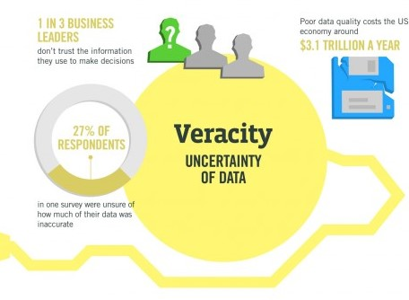

```{r setup, include=FALSE}
knitr::opts_chunk$set(echo = FALSE)
#to install xaringan
#install.packages("devtools")
#devtools::install_github("yihui/xaringan")
library(png)
library(kableExtra)
library(ggplot2)
library(grid)
library(gridExtra)
library(RefManageR)
library(tidyverse)
library(data.table)
knitr::write_bib(x = "rmarkdown", file = "bib.bib")
```
```{r xaringan-theme, include=FALSE}
library(xaringanthemer)
mono_light(
   base_color = "#1c5253",
  header_font_google = google_font("Josefin Sans"),
  text_font_google   = google_font("Montserrat", "300", "300i"),
  code_font_google   = google_font("Droid Mono"),
  extra_css = list(".small" = list("font-size" = "50%"))
)
```

# Learning Outcomes

At the end of this lesson, students should be able to:

1. interpret **scatterplots**.

---

# Outlines


- What is Big Data?

- Data Science VS Data Analytics

- Statistical Analysis VS Data Analytics


---

class: inverse, center, middle

# BIG DATA

---
# The 8Vs of Big Data

```{r echo=FALSE,fig.align='center',out.width="70%"}

```
---

# The 8Vs of Big Data

## 01 Volume
.pull-left[
- The size of the data

What is Big Data
- Terrabytes to 10s of petabytes of the storage system

What is not Big Data
- A few gigabtes

]
.pull-right[
```{r echo=FALSE}

```
.small[source: IBM]
]
---

# The 8Vs of Big Data

## 02 Value
.pull-left[
- Just having Big Data is of no use unless we can turn it into value

What is Big Data

-  Raw data of Big Data is of low value
   -  For example, single observations
-  Analytics and theory about the data increases the alue
   -  Analytics transform big data into smart (valuable) data!

]
.pull-right[
```{r echo=FALSE, fig.cap="source: IBM"}
knitr::include_graphics('figure/')
```
]

---

# The 8Vs of Big Data

## 03 Veracity

The trustworthiness of the data in terms of accuracy
.pull-left[
- Data involves some uncertainty and ambiguities
- Mistakes can be introduced by human and machines
- Examples: 
  -  People sharing accounts
  - Like sth today, dislike it tomorrow
  - Wrong system timestamps
Data Quality is vital!
- Analytics and conclusions rely on good data quality
- GIGO paradigm: *Garbage In - Garbage Out

]
.pull-right[
```{r fig.cap="source: IBM"}

```
]

---

# The 8Vs of Big Data

## 04 Visualisation
.pull-left[
- 

]
.pull-right[
```{r echo=FALSE}
knitr::include_graphics('figure/')
```
]
---

# The 8Vs of Big Data

## 05 Variety
.pull-left[
- The different types of data

What is Big Data?
- Use data from multiple sources and in multiple forms
- Involved unstructured and semi-structured data
]
.pull-right[
```{r echo=FALSE,fig.cap="source: IBM"}

```
]

---
# The 8Vs of Big Data

## 05 Variety

- Structured data
   -  Like tables with fixed attributes/variables
   -  Traditionally handled by relational databases
- Unstructured data
   -  Usually generated by humans
   -  E.g. natural language, voice, Wikipedia, Twitter posts
   -  Must be processed into (semi-structured) data to gain value
- Semi-structured data
   -  Has some structure in tags but it changes with documents
   -  Examples: HTML, XML, JSON files, server logs
---

# The 8Vs of Big Data

## 06 Velocity
.pull-left[
- Data Volume per time
- The speed at which the data is generated

What is Big Data
- 30 KiB to 30 GiB per second (902 GiB/year to 902 PiB/year)

What is not Big Data
- A never changing data set

]
.pull-right[
```{r cache=FALSE,fig.cap="IBM"}

```
]

---

# The 8Vs of Big Data

## Data Sources
.pull-left[
- Enterprise data
   -  Customer information
   -  Transactions, e.g. purchases
- Experimental/Observational Data (EOD)
   -  Created by machines from sensors/devices
   -  Trading systems, satellites
   -  Microscopes, video streams, smart meters
- Social media
   -  Created by humans
   -  Messages, posts, blogs, Wikis
]
.pull-right[
```{r echo=FALSE}
knitr::include_graphics('figure/')
```
]

---

# The 8Vs of Big Data

## 07 Viscosity
.pull-left[
- 

]
.pull-right[
```{r echo=FALSE}
knitr::include_graphics('figure/')
```
]

---


# The 8Vs of Big Data

## 08 Virality
.pull-left[
- 

]
.pull-right[
```{r echo=FALSE}
knitr::include_graphics('figure/')
```
]
---
# Data Science
---

# Data Science
## Related Areas
1. Banking
2. Finance
3. Manufacturing
4. Transport
5. E-commerce
6. Life Science, Medical and Healthcare

---
# Data Science
## Life Science, Medical & Healthcare
1. Medical Imaging
   - analysing X-rays, MRIs, CT-Scans
   - automatically detect flaws in the imagery 
   - using image recognition tools to understand complex medical imagery.
2. Genomics
   - analyse how genes react to various kinds of medicines.
   - MapReduce has significantly reduced the processing time for genome sequencing.
3. Drug Discovery
   - simplifying the complex process.
   - provide early insight into the success rate of newly discovered drug.
   - analyse several combinations of drugs and their effect on different gene structure to predict outcome.
4. Predictive Analytics in Healthcare
   - Predict the outcome of disease given the historical data of the patients.
   - enable practitioners to analyse data, make correlations between variables and provide insights to doctors and medical practitioners.
5. Monitoring Patient Health
6. Tracking and Preventing Diseases
7. Providing Virtual Assistance (Healthbots)
   - Intelligent bots that answer to user queries have been created using NLP.
   - In healthcare sector, healthbots are used to answer questions from patients and provide them with proper diagnostic guidelines.

---

# Data Science
## Tools
---

# Artificial Intelligence (AI)

---
# Artificial Intelligence (AI)
## Areas of AI
---
# Machine Learning
```{r echo=FALSE,fig.align='center',out.width="70%"}

```

---
# Machine Learning
## Unsupervised
---
# Machine Learning
## Supervised
---
# Machine Learning
## Deep Learning
---
# Model Evaluation
- Regression
- Classification
- Clustering
---

class: inverse, center, middle

# DATA ANALYSIS VS STATISTICAL ANALYSIS

---

# Data Analysis VS Statistical Analysis

## The difference

- Both are used hand in hand to solve problems.
- Statistical analysis
   -  applies statistical methods to gain understanding of a larger population by analysing the information of a sample.
   -  allows inferences and prediction of the behaviour and characteristics of population from a sample
- Data analysis 
   -  includes process of inspecting, cleaning, transforming, modeling, presenting and reporting data into useful information that can be understood by non-technical people.
   -  the process can be used as an input into performing statistical analysis.
   - one of the techniques is Data Analytics - process of turning data into useful insights.

---

class: inverse, center, middle

# DATA ANALYSIS

---

class: inverse, center, middle

# DATA ANALYTICS

---
# Data Analytics
## The Steps

```{r echo=FALSE,fig.align='center',out.width="60%"}

```
---

# Data Analysis
## Types

- Descriptive Analysis
- Exploratory Data Analysis
- Inferential
- Predictive
---
# Data Analysis
## Visual Data Analysis

---
# Data Analysis
## Complex Data Analysis

---

# Data Analysis
## Data Analysis Workflow
```{r echo=FALSE,fig.align='center',out.width="70%"}

```
Source: Gilbert Miller, Peter Mork from Data to Decision: A Value 
Chain for Big Data
Refer: /itpro-14-06-smart.pdf


---
# Data Analysis Workflow
## Data Discovery

.pull-left[
- Collect and Annotate
   -  Create an inventory of data sources and the metadata that describe them.
   -  Turning unstructured data into structured data associated with valid metadata.

- Prepare
   -  Enable access to sources and set up access-control rules
   -  establish access to the data sources by copying them into a shared system
   - setting up security and privacy restrictions for data use
-  Organize
   -  Identify syntax, structure and semantics for each data source.

]
.pull-right[
```{r echo=FALSE}
knitr::include_graphics('figure/')
```
]


---

# Data Analysis Workflow
## Data Integration

.pull-left[
- Integrate
   -  Establish a common data representation of the data. Maintain data provenance.
]
.pull-right[
```{r echo=FALSE}
knitr::include_graphics('figure/')
```
]

---

# Data Analysis Workflow
## Data Exploitation

.pull-left[
- Analyse
  -  Analyse integrated data.
-  Visualise
  -  Present analytic results to a decision maker as an interactive application that supports exploration and refinement
-  Make decisions
  -  Determine what actions (if any) to take on the basis of the interpreted results  
]
.pull-right[
```{r echo=FALSE}
knitr::include_graphics('figure/')
```
]
---

# EDA
---

# Concept of Tidy Data
## https://programminghistorian.org/en/lessons/data_wrangling_and_management_in_R
---

# Should include example of data analytics process
## Starting from kaggle
## data cleaning
##  eda (tidy data)
## data visualisation
## word cloud
## correlation graph - https://rstudio-pubs-static.s3.amazonaws.com/240657_5157ff98e8204c358b2118fa69162e18.html#plain-correlation-matrix
---
# Good Example using Quora
https://www.kaggle.com/mjbahmani/a-data-science-framework-for-quora
Modern Dive
https://moderndive.com/index.html#introduction-for-instructors


---
class: inverse, center, middle

# DATA ANALYTICS
## Practical

---


# Learning Outcomes

## Now you should be able to:

1. interpret **scatterplots**.

1. differentiate between **correlation** and **regression**.

1. evaluate and interpret the **Pearson’s** and **Spearman’s rank correlation coefficient**.

1. evaluate the **significance of correlation coefficient**.

1. formulate the **regression equations** and explain about the **variation of regression lines**.

1. calculate and interpret **coefficient and determination**.


---
# References

```{r, load_refs, echo=FALSE}

bib <- ReadBib("bib.bib", check = FALSE)
ui <- "- "
```
```{r, print_refs, results='asis', echo=FALSE, warning=FALSE, message=FALSE}
writeLines(ui)
print(bib[key = "R-rmarkdown"], 
  .opts = list(check.entries = FALSE, 
               style = "html", 
               bib.style = "authoryear"))
```


---

class: center, middle

# Thanks!

Download statistical tables at http://bit.ly/2MpUvZz.

Slides created via the R package [**xaringan**](https://github.com/yihui/xaringan).

